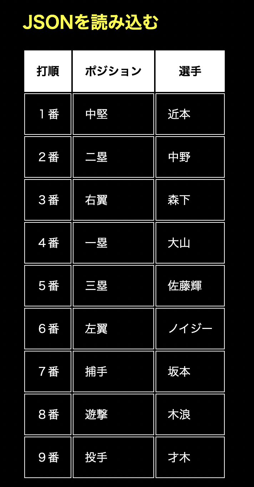

# JSON・MarkdownファイルをHTMLに読み込む（Fetch　APIを使う場合）
webサイトを制作していて、フロントエンドのコードとデータを分けて管理したい時ってありますよね？

- プロフィールなどのちょっとしたデータのまとまりをページ内に表示したいけど、データベースを作るほどではない…
- ブログページなどで、原稿を書く人とコーディングする人が別の場合、原稿に修正が入る度にコードも書き直さなければいけなくて面倒…
- なるべく素のJavaScriptで処理したい（Node.jsのfsとかを使うほどではない...）

といった場合に、JSONやMarkdownファイルを直接HTMLファイルに読み込む方法を調べました。

## JSONファイルを読み込む場合
まず、JSONファイルを読み込んでDOMに追加する場合のやり方です。
こんな感じのJSONデータをまとめた`tigers.json`ファイルがあるとします。
(昨年阪神がアレしたときのスタメンです)

```JSON:tigers.json
[{"打順":"１番","ポジション":"中堅","選手":"近本"},{"打順":"２番","ポジション":"二塁","選手":"中野"},{"打順":"３番","ポジション":"右翼","選手":"森下"},{"打順":"４番","ポジション":"一塁","選手":"大山"},{"打順":"５番","ポジション":"三塁","選手":"佐藤輝"},{"打順":"６番","ポジション":"左翼","選手":"ノイジー"},{"打順":"７番","ポジション":"捕手","選手":"坂本"},{"打順":"８番","ポジション":"遊撃","選手":"木浪"},{"打順":"９番","ポジション":"投手","選手":"才木"}]
```

このJSONデータを、`index.html`ファイル内の`id="exportJson"`を持ったdiv要素内に、table要素として表示したいと思います。

```HTML:index.html
<div id="exportJson">
    <!--ここに表形式で出力-->
</div>
```

```JavaScript:script.js
//getElementByIdで出力先を指定
let exportJson = document.getElementById("exportJson");
let table = document.createElement("table");
table.innerHTML = "<thead><tr><th>打順</th><th>ポジション</th><th>選手</th></tr></thead>";
let tbody = document.createElement("tbody");
table.appendChild(tbody);
```
`getElementById()`メソッドで出力先を指定し、`createElement()`メソッドでtable要素を追加しておきます。

### fetch()でJSONデータを取得
ここから、`fetch()`メソッドを利用して、`tigers.json`の内容をGETし、DOMに追加していきます。

```JavaScript:script.js
fetch("tigers.json", {
    method: "GET",
}).then(response => response.json())
.then(json => {
    for (let key in json) {
        let tr = document.createElement("tr");
        tr.innerHTML = "<td>" + json[key]["打順"] + "</td><td>" + json[key]["ポジション"] + "</td><td>" + json[key]["選手"] + "</td>";
        tbody.appendChild(tr);
        table.appendChild(tbody);
        exportJson.appendChild(table);
    }
});
```

JSON内の各オブジェクトは`json[key]`で取得でき、オブジェクトのプロパティには`json[key]["打順"]`のように指定してアクセスすることができます。
これで、`index.html`上にJSONデータを元にしたtableが表示されます。



## Markdownファイルを読み込む場合
次に、Markdownファイルを読み込んでDOMに追加する方法です。
基本的な方法はJSONファイルの時と同じですが、MarkdownをHTMLに変換するために、`Marked.js`というライブラリを利用します。

参考：[marked.js](https://marked.js.org/)

こんな感じの`tigers.md`ファイルがあるとします。

```Markdown:tigers.md
# 六甲颪

## 1番
六甲おろしに颯爽(さっそう)と

蒼天(そうてん)翔ける日輪の

青春の覇気麗しく

輝く我が名ぞ阪神タイガース

オウ オウ オウオウ

阪神タイガース フレ フレフレフレ

（...続く）
```

この`.md`ファイルの内容を、`index.html`の`id="exportMarkDown"`を持ったdiv要素内に出力します。`index.html`上で`marked.js`も忘れずに読み込んでおきます。

```HTML:index.html
<h2>Markdownを読み込む</h2>
<div id="exportMarkDown">
    <!--ここにMarkdownを出力-->
</div>

<!--Markd.jsの読み込み-->
<script src="https://cdn.jsdelivr.net/npm/marked/marked.min.js"></script>
```

そして、JavaScriptでJSONファイルの時と同様に、`fetch()`メソッドを利用して`tigers.md`ファイルを読み込みます。

```JavaScript:script.js
//getElementByIdで出力先を指定
let exportMarkdown = document.getElementById("exportMarkDown");
fetch("tigers.md", {
    method: "GET",
}).then(response => response.text())
.then(text => {
    exportMarkdown.innerHTML = marked.parse(text);
});
```

HTMLへの出力の部分では、`Marked.js`の`marked.parse()`メソッドを利用しています。
これで、`index.html`上にMarkdownファイルの内容がDOM要素として追加されます。


参考:[フェッチ API の使用](https://developer.mozilla.org/ja/docs/Web/API/Fetch_API/Using_Fetch)